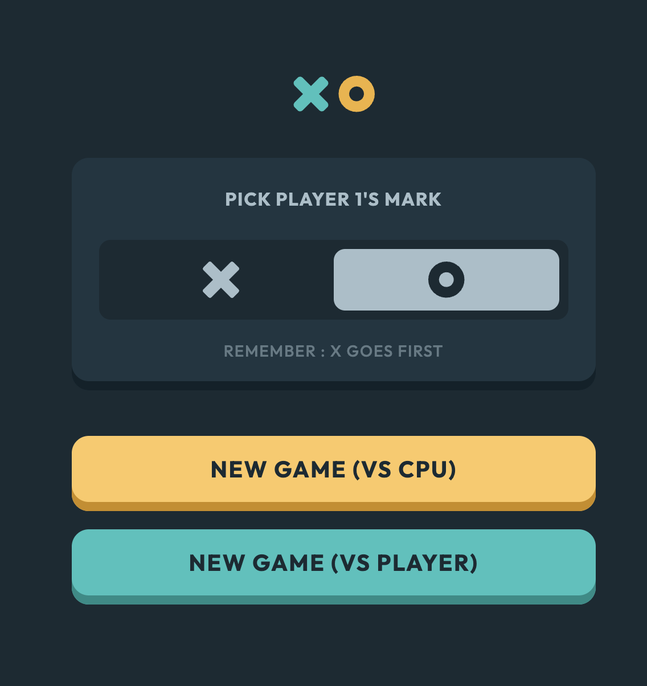
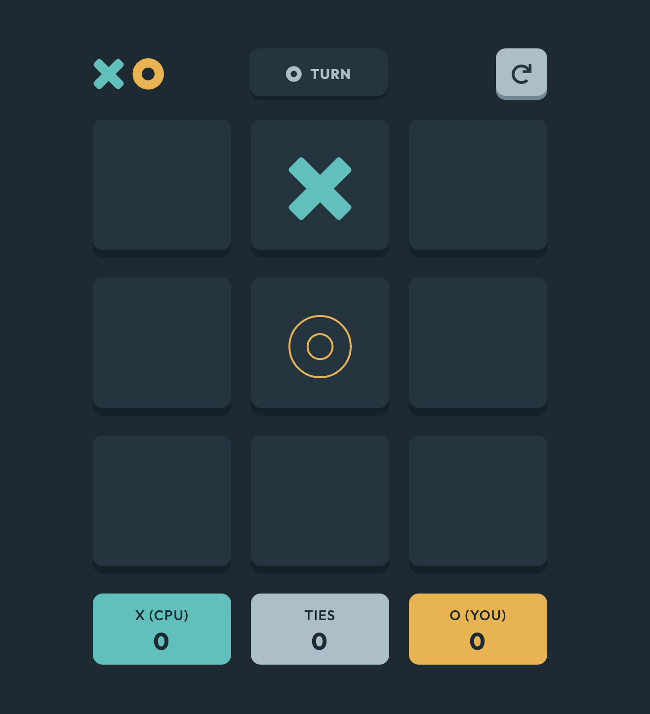
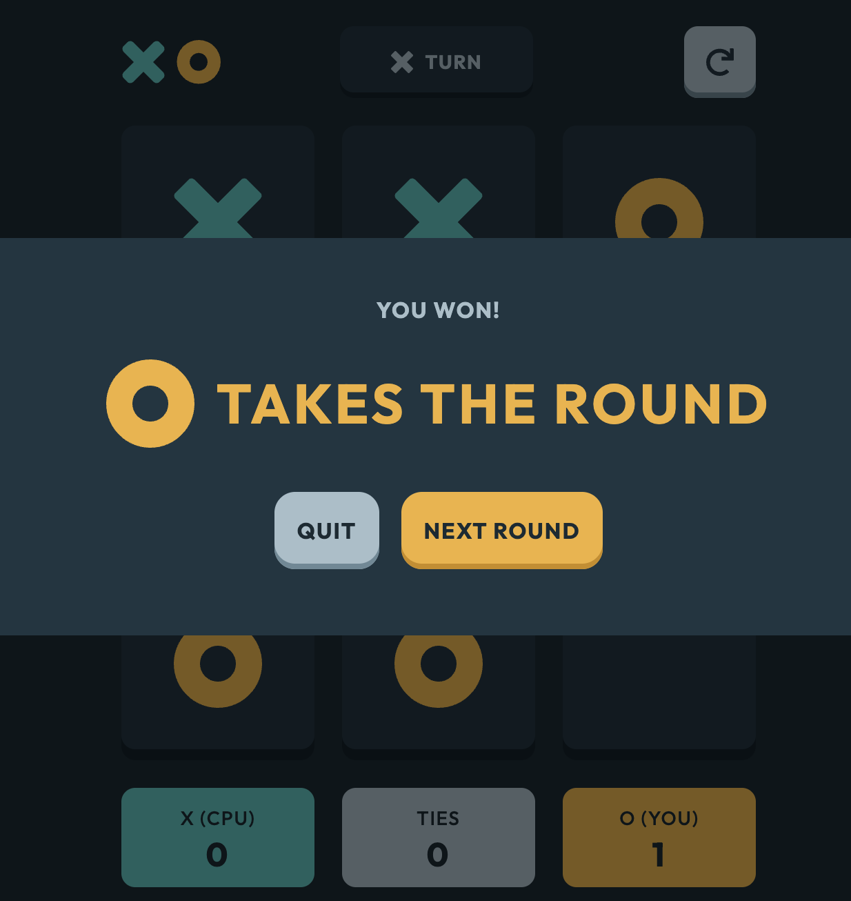
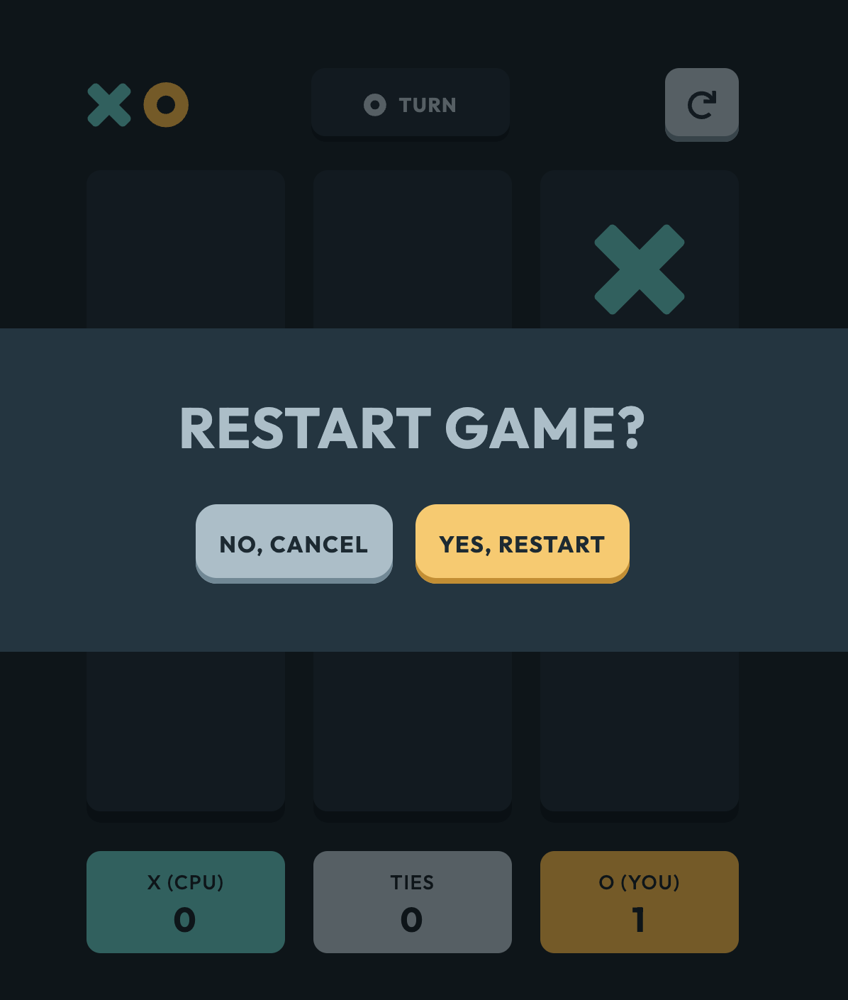

# Frontend Mentor - Tic Tac Toe solution

This is my solution to the [Tic Tac Toe challenge on Frontend Mentor](https://www.frontendmentor.io/challenges/tic-tac-toe-game-Re7ZF_E2v). Frontend Mentor challenges help you improve your coding skills by building realistic projects. 

## Table of contents

- [Overview](#overview)
  - [The challenge](#the-challenge)
  - [Screenshot](#screenshot)
  - [Links](#links)
- [My process](#my-process)
  - [Built with](#built-with)
- [Author](#author)

## Overview

### The challenge

Users should be able to:

- View the optimal layout for the game depending on their device's screen size
- See hover states for all interactive elements on the page
- Play the game either solo vs the computer or multiplayer against another person


### Screenshot









### Links

- Solution URL: [solution URL](https://github.com/roodhouse/frontend-mentor-tic-tac-toe)
- Live Site URL: [live site](https://tic.rugh.us)

## My process

### Built with

- HTML5, CSS
- Mobile-first workflow
- React
- Tailwind

### What I learned

This was a fun project to build. I was able to solidified my React knowledge more by utilizing .map() and Array.from.

```js
{Array.from({ length: 9 }).map((_, index) => (
                <SquareContainer key={index} turn={turn} changeTurn={changeTurn} index={index} playerXarray={playerXarray} playerOarray={playerOarray} restarted={restarted} newRound={newRound} theCompetition={theCompetition} theGrid={theGrid} updateGrid={updateGrid} />
))}
```

## Author

- Website - [my site](https://rugh.us)
- Frontend Mentor - [@roodhouse](https://www.frontendmentor.io/profile/roodhouse)
- LinkedIn - [John Rugh](https://www.linkedin.com/in/john-m-rugh/)
